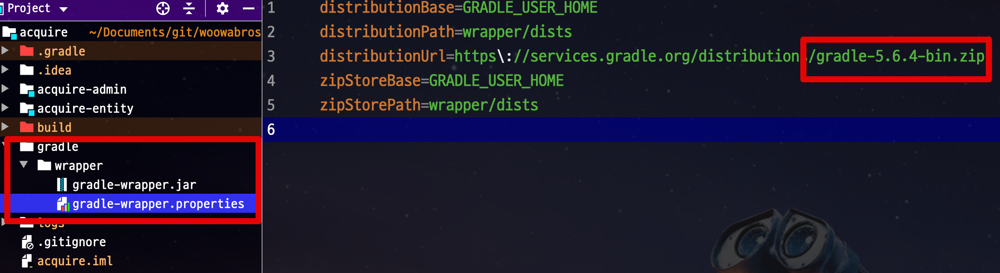

# 스프링부트2로 웹서비스 출시하기 (프리렉)

예제 코드

## 주의

이 프로젝트는 실제로 실행하면 정상작동 하지 않습니다.
**구글/네이버 토큰 정보가 없기 떄문**입니다.  
테스트 코드 수행만 정상적으로 되니 **코드만 참고하세요**

## 오타 & 오류 제보

상단의 [Issue 탭](https://github.com/jojoldu/freelec-springboot2-webservice/issues)에서 검색 혹은 추가 이슈등록을 부탁드립니다!

### 질문 올리는 법

* 페이지 번호
* 문제가 된 프로젝트가 올라간 Github 저장소 주소
* 문제가 된 로그 혹은 콘솔 출력 화면

을 함께 포함해서 남겨주세요.  
그렇지 않으면 확인 하기가 너무 어렵습니다.

* [이슈 참고](https://github.com/jojoldu/freelec-springboot2-webservice/issues/100)

## 프로젝트 환경 점검

이 책의 모든 예제는 다음의 환경에서 진행됩니다.

* Java 8
* Gradle 4.x
* Spring Boot 2.1.x

즉, 현재 spring.io 에서 만들어주는 기본 환경인 **Spring Boot 2.2.x**와 **Gradle 5.x**에서는 정상작동 하지 않습니다.

> Spring Boot 2.2와 Gradle 5로 오면서 너무 많은 설정들이 변경되었습니다.
> 현재 실무에서 가장 많이 사용되는 버전들인 2.1.x와 Gradle 4를 선택할 수 밖에 없는 이유입니다.

아래를 따라 본인의 프로젝트 환경을 점검해보세요.

### Gradle 버전 체크

먼저 현재 프로젝트의 그레이들 버전을 체크해봅니다.
 


위와 같이 5 버전을 사용중인게 확인된다면  
인텔리제이에서 ```alt+F12``` (윈도우/맥 동일) 을 눌러 해당 프로젝트 기준으로 터미널을 열어봅니다.  
거기서 아래와 같이 명령어를 실행하시면 됩니다.

```bash
gradlew wrapper --gradle-version 4.10.2
```

### Spring Boot 버전 체크

Spring Boot 버전은 다음과 같이 되어있어야 합니다.  
  
**build.gradle**  
  
```groovy
buildscript {
    ext {
        springBootVersion = '2.1.7.RELEASE' // 2.1.7, 2.1.8, 2.1.9 다 괜찮습니다.
    }
    repositories {
        mavenCentral()
        jcenter()
    }
    dependencies {
        classpath("org.springframework.boot:spring-boot-gradle-plugin:${springBootVersion}")
    }
}
```

아래와 같이 되어있으면 안됩니다.
```groovy
plugins {
    id 'org.springframework.boot' version '2.2.1.RELEASE'
    ...
}
```

이외 나머지는 프로젝트 코드와 책 내용을 참고하시면 됩니다. 


